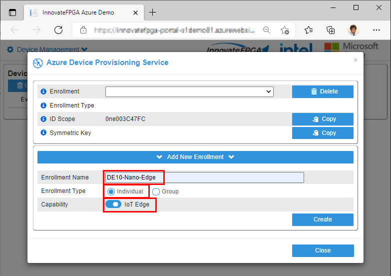
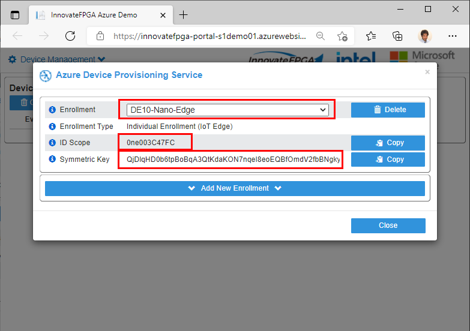
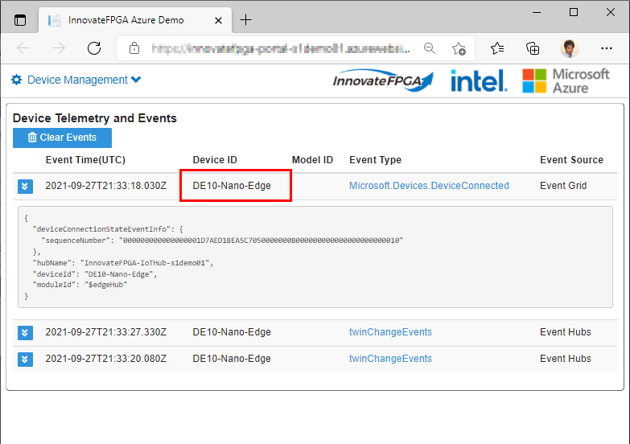
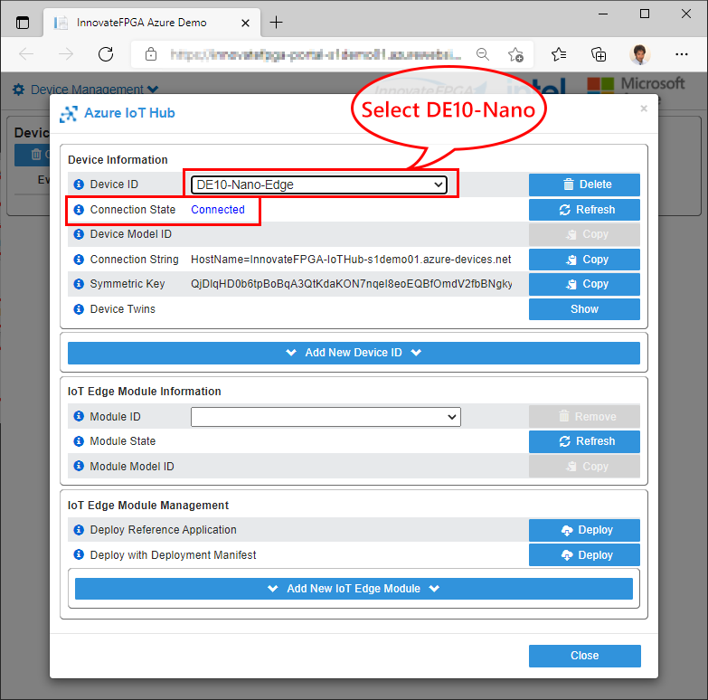

<!---
date : 9/1/2021
author : Daisuke Nakahara <daisuken@microsoft.com>
reviewer : Berry Tsai <betsai@microsoft.com>; Takehiro Hirai <takehiro.hirai@microsoft.com>
Maintainer : 
title : Azure IoT Sample Solution provisioning DE10-nano
--->

# Connecting DE10-Nano to your IoT Solution as Azure IoT Edge device

In order to run the reference application as Azure IoT Edge module, you must :

1. Prepare DE10-Nano to run Moby container engine
1. Install Azure IoT Edge Runtime
1. Create DPS enrollment with Azure IoT Edge capacity turned on
1. Configure Azure IoT Edge Runtime with provisioning information
1. Deploy the reference application as Azure IoT Edge module

> [!IMPORTANT]  
> If you are using Ubuntu 18.04 image from Terasic, you can skip step 1 and 2.  
> Skip to [Step 3](#3-create-dps-enrollment)

## 1. Prepare DE10-Nano to run Moby container engine

Prepare Ubuntu 18.04 to reference Microsoft packages with :

```bash
curl https://packages.microsoft.com/config/ubuntu/18.04/multiarch/prod.list > ./microsoft-prod.list && \
sudo cp ./microsoft-prod.list /etc/apt/sources.list.d/ && \
curl https://packages.microsoft.com/keys/microsoft.asc | gpg --dearmor > microsoft.gpg && \
sudo cp ./microsoft.gpg /etc/apt/trusted.gpg.d/
```

Install Moby container engine using package manager with :

```bash
sudo apt-get update && \
sudo apt-get install -y moby-engine
```

## 2. Install Azure IoT Edge Runtime

Once container engine is installed and running, install Azure IoT Edge Runtime with :

```bash
curl -L https://github.com/Azure/azure-iotedge/releases/download/1.2.4/aziot-identity-service_1.2.3-1_ubuntu18.04_armhf.deb -o aziot-identity-service.deb && \
sudo apt-get install -y ./aziot-identity-service.deb && \
curl -L https://github.com/Azure/azure-iotedge/releases/download/1.2.4/aziot-edge_1.2.4-1_ubuntu18.04_armhf.deb -o aziot-edge.deb && \
sudo apt-get install -y ./aziot-edge.deb
```

> [!IMPORTANT]  
> The reference application requires Azure IoT Edge Runtime version 1.2.4 or above.
> Check the version of Azure IoT Edge Runtime with :
>
> ```bash
> root@de10nano:~# iotedge version
> iotedge 1.2.4
> ```

## 3. Create DPS enrollment

Similar to [this step](PaaS-Provision.md#8-create-dps-enrollment), create a DPS individual enrollment with Azure IoT Edge capacity turned on :



## 4. Configure enrollment information

Configure Azure IoT Edge runtime with DPS Enrollment Information by updating `/etc/aziot/config.toml` :

1. Create `config.toml` file from `config.toml.template` with :

    ```bash
    cp /etc/aziot/config.toml.template /etc/aziot/config.toml
    ```

1. Open `/etc/aziot/config.toml` with your favorite text editor  

    Example :

    ```bash
    nano /etc/aziot/config.toml
    ```

1. Scroll down to locate `DPS provisioning with symmetric key`  

    ```bash
    ## DPS provisioning with symmetric key
    # [provisioning]
    # source = "dps"
    # global_endpoint = "https://global.azure-devices-provisioning.net/"
    # id_scope = "0ab1234C5D6"
    #
    # [provisioning.attestation]
    # method = "symmetric_key"
    # registration_id = "my-device"
    #
    # symmetric_key = { value = "YXppb3QtaWRlbnRpdHktc2VydmljZXxhemlvdC1pZGVudGl0eS$
    # symmetric_key = { uri = "file:///var/secrets/device-id.key" }                $
    # symmetric_key = { uri = "pkcs11:slot-id=0;object=device%20id?pin-value=1234" $
    ```

1. Uncomment **[provisioning section]** by removing `#`  

    ```bash
    ## DPS provisioning with symmetric key
    [provisioning]
    source = "dps"
    global_endpoint = "https://global.azure-devices-provisioning.net/"
    id_scope = "0ab1234C5D6"
    #
    [provisioning.attestation]
    method = "symmetric_key"
    registration_id = "my-device"
    #
    symmetric_key = { value = "YXppb3QtaWRlbnRpdHktc2VydmljZXxhemlvdC1pZGVudGl0eS"
    # symmetric_key = { uri = "file:///var/secrets/device-id.key" }                $
    # symmetric_key = { uri = "pkcs11:slot-id=0;object=device%20id?pin-value=1234" $
    ```

1. Navigate to Azure Device Provisioning Service menu in the sample IoT solution, then copy & paste `ID Scope`, `Enrollment Name`, and `Symmetric Key`.

    ```bash
    ## DPS provisioning with symmetric key
    [provisioning]
    source = "dps"
    global_endpoint = "https://global.azure-devices-provisioning.net/"
    id_scope = "ID Scope from the solution"
    #
    [provisioning.attestation]
    method = "symmetric_key"
    registration_id = "Enrollment Name from solution"
    #
    symmetric_key = { value = "Symmetric Key from solution"
    # symmetric_key = { uri = "file:///var/secrets/device-id.key" }                $
    # symmetric_key = { uri = "pkcs11:slot-id=0;object=device%20id?pin-value=1234" $
    ```

    

    > [!TIP]  
    > Use `Copy` button to copy ID Scope and Symmetric key

    Example :

    ```bash
    ## DPS provisioning with symmetric key
    [provisioning]
    source = "dps"
    global_endpoint = "https://global.azure-devices-provisioning.net/"
    id_scope = "0ne003C47FC"
    #
    [provisioning.attestation]
    method = "symmetric_key"
    registration_id = "DE10-Nano-Edge"
    #
    symmetric_key = { value = "QjDIqHD0b6tp....."
    # symmetric_key = { uri = "file:///var/secrets/device-id.key" }                $
    # symmetric_key = { uri = "pkcs11:slot-id=0;object=device%20id?pin-value=1234" $
    ```

1. Save the changes to `config.toml`  

    E.g., with nano editor, press **`CTRL + x`** to save and exit.

1. Apply the new configuration with :  

    ```bash
    iotedge config apply
    ```

    This command stops all related services and restart them with new settings.

    Output example :  

    ```bash
    root@de10nano:~# iotedge config apply
    Note: Symmetric key will be written to /var/secrets/aziot/keyd/device-id
    Azure IoT Edge has been configured successfully!
    
    Restarting service for configuration to take effect...
    Stopping aziot-edged.service...Stopped!
    Stopping aziot-identityd.service...Stopped!
    Stopping aziot-keyd.service...Stopped!
    Stopping aziot-certd.service...Stopped!
    Stopping aziot-tpmd.service...Stopped!
    Starting aziot-edged.mgmt.socket...Started!
    Starting aziot-edged.workload.socket...Started!
    Starting aziot-identityd.socket...Started!
    Starting aziot-keyd.socket...Started!
    Starting aziot-certd.socket...Started!
    Starting aziot-tpmd.socket...Started!
    Starting aziot-edged.service...Started!
    Done.
    ```

1. After a few minutes, the device should provision to the IoT solution.

    

1. Confirm DE10-Nano is provisioned and connected to Azure IoT Hub.

    Select `Device Information (IoT Hub)` from menu then select DE10-Nano.

    > [!CAUTION]  
    > It may take several minutes to deploy module, depending on internet connection speed, etc.
    > Click `Refresh` button to update Connection State.  
    > Once IoT Edge runtime completes provisioning, the device id (same as Enrollment Name) will be added to the `Device ID` list

    

## Completed

Congratulations! You installed and configured Azure IoT Edge Runtime.  DE10-Nano is running as Azure IoT Edge device and connected to the sample IoT solution.

## Resources

- <https://docs.microsoft.com/azure/iot-edge/how-to-install-iot-edge?view=iotedge-2020-11>

## Next Step

- [Deploy Reference Application as an IoT Edge Module](./DE10-Nano-IoTEdge-Deploy.md)
- [Back to README](../README.md)
