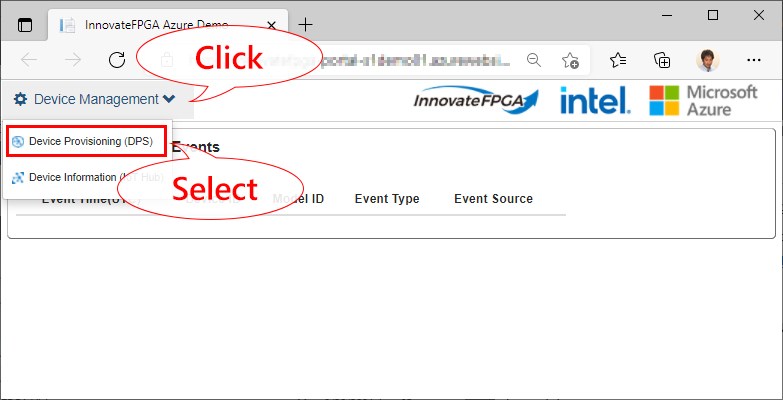
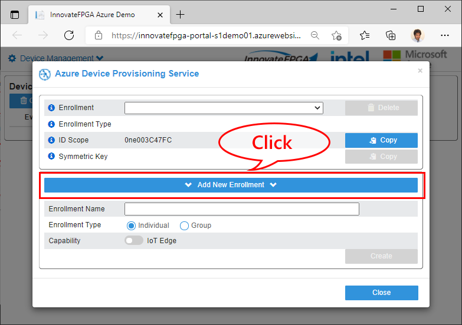
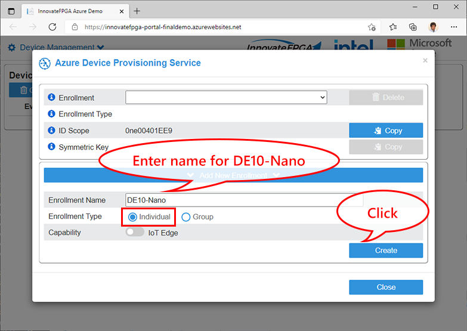
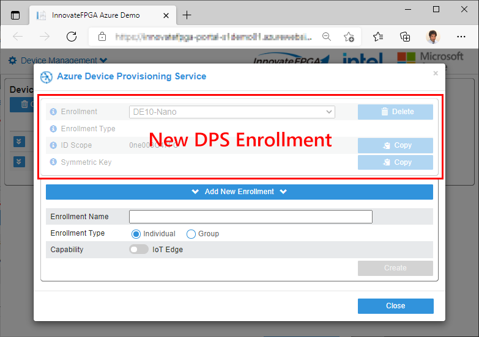
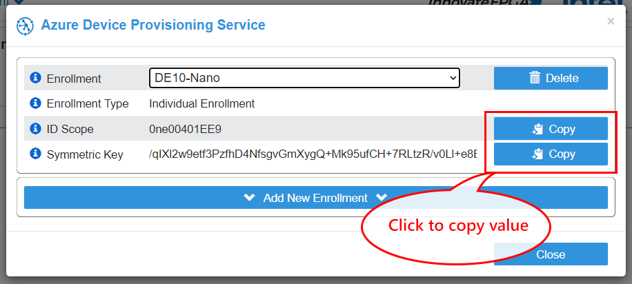
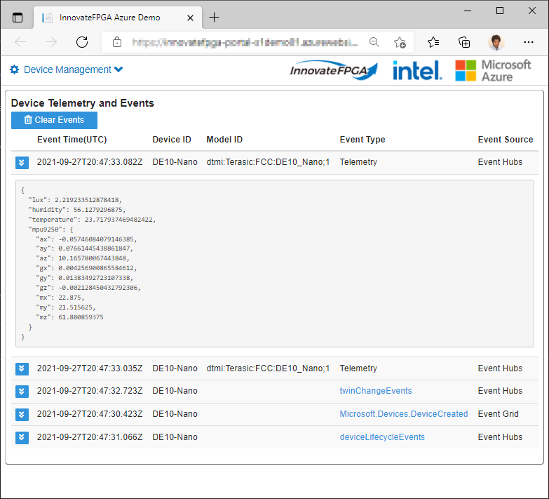

<!---
date : 9/1/2021
author : Daisuke Nakahara <daisuken@microsoft.com>
reviewer : Berry Tsai <betsai@microsoft.com>; Takehiro Hirai <takehiro.hirai@microsoft.com>
Maintainer : 
title : Azure IoT Sample Solution provisioning DE10-nano
--->

# Connecting DE10-Nano to your IoT Solution

In order to connect your DE10-Nano to Azure IoT Hub, you must provision your DE10-Nano.  Provisioning is done through Device Provisioning Service (DPS).
Once your DE10-Nano is provisioned, it can connect to IoT Hub.  Steps involved in connecting DE10-Nano are :

1. Flash SD Card with Ubuntu 18 image
1. Boot DE10-Nano
1. Connect DE10-Nano over UART or SSH
1. Clone Reference Application
1. Set up DE10-Nano for Python application
1. Create DPS Enrollment for DE10-Nano
1. Configure your DE10-Nano with DPS provisioning information
1. Run reference device application

Reference device application provides two versions of runtime.

- Python application
- Azure IoT Edge module (written in Python)

This document describes how to run Python application to provision to the sample IoT solution.

## 1. Flash SD Card with Ubuntu 18 Image

1. Download **Ubuntu 18.04 disk image** from Terasic

   <http://download.terasic.com/downloads/cd-rom/de10-nano/AzureImage/DE10-Nano-Cloud-Native_18.04.zip>

1. Flash SD card using Disk Image application such as [balenaEtcher](https://www.balena.io/etcher/) or [Rufus](https://rufus.ie/)

> [!NOTE]  
> The SD Card image contains following additional components :
>  
> - Python3.7
> - Moby container engine
> - Azure IoT Edge Runtime
>
> If you would like to start from clean OS, please refer documentation at <TBD: Intel Doc Link>

## 2. Assemble DE10-Nano

Assemble DE10-Nano and connect cables.

- Ethernet cable for Internet connection
- Mini-USB to Type-A USB Cable for Serial Console
- HDMI cable (Optional)


## 3. Connect Serial Terminal

- Connect Mini-USB cable to your PC.  
- Install Serial Terminal such as Putty or Teraterm on your PC.
- Configure Serial Port with :

    | Setting      | Value              |
    |--------------|--------------------|
    | Port         | Serial Port Number |
    | Baud rate    | 115200             |
    | Data         | 8 bits             |
    | Parity       | None               |
    | Stop Bit     | 1 bit              |
    | Flow Control | None               |

If you do not have Mini-USB cable, use SSH or local console (requires HDMI monitor and USB Keyboard) to connect to DE10-Nano.

## 4. Initialize DE10-Nano

Boot DE10-Nano with Ubuntu 18.04 image.  

> [!TIP]  
> The default user name and password for DE10-Nano are:
>
> - User Name : root
> - Password  : de10nano

After the initial boot, it is recommended to :

- Change password for root with :

    ```bash
    passwd
    ```

    Then enter new password when prompted.

- Update package catalog with :

    ```bash
    apt update
    ```

- Expand file system so you do not run out of disk space.

    1. Expand rootfs with :

        ```bash
        ./expand_rootfs.sh
        ```

    1. Reboot DE10-Nano when prompted with :

        ```bash
        reboot now
        ```

    1. After reboot, complete the process with :

        ```bash
        ./resize2fs_once
        ```

- Set Static IP

    DE10-Nano does not have hardware MAC address.  As a result, IP Address may change on every boot.  You may configure DE10-Nano with static IP.

    [Instruction](DE10-Nano-Setup.md#option-static-ip)

- Install your favorite tools such as text editor

## 5. Disable overlay during boot

Disable FPGA overlay during boot by commenting out following lines in `/overlay/fpgaoverlay.sh`

> [!WARNING]  
> The default overlay include frame buffer for HDMI output.  HDMI will not work after disabling the default overlay.  
> Make sure you have UART or SSH connection to DE10-Nano from your development machine.

E.g., with Nano editor :

```bash
nano /overlay/fpgaoverlay.sh
```

Locate following lines in fpgaoverlay.sh

```bash
echo "creating $overlay_dir"
mkdir $overlay_dir

echo "Doing Device Tree Overlay"
echo overlay.dtbo > $overlay_dir/path

echo "Successfully Device Tree Overlay Done"

echo "Loading altvipfb"
modprobe altvipfb
echo "Successfully altvipfb is loaded"
```

Comment out following lines by adding **#** to beginning of each line.

```bash
#echo "creating $overlay_dir"
#mkdir $overlay_dir

#echo "Doing Device Tree Overlay"
#echo overlay.dtbo > $overlay_dir/path

#echo "Successfully Device Tree Overlay Done"

#echo "Loading altvipfb"
#modprobe altvipfb
#echo "Successfully altvipfb is loaded"
```

Save the change and reboot DE10-Nano.

> [!IMPORTANT]  
> You must reboot DE10-Nano for this change to take effect.

## 6. Clone reference application

Clone reference application with :

```bash
cd ~ && \
apt update && \
git clone https://github.com/intel-iot-devkit/terasic-de10-nano-kit.git
```

This will clone the reference application to ~/terasic-de10-nano-kit.

## 7. Set up DE10-Nano for Python application

Install Python libraries for the reference application with :

```bash
cd ~/terasic-de10-nano-kit/azure-de10nano-document/sensor-aggregation-reference-design-for-azure/sw/software-code/modules/RfsModule && \
python3.7 -m pip install -r ./requirements.txt
```

> [!TIP]  
> The path may be too long to fit to the default console.  You can increase console size with `stty` command.
> For example, changing console to 200x200 :
>
> ```bash
> stty columns 200 rows 200
> ```

## 8. Create DPS Enrollment

An [enrollment](https://docs.microsoft.com/azure/iot-dps/concepts-service#enrollment) is a way to register your DE10-Nano to your IoT solution.  With Azure Device Provisioning Service (DPS), your DE10-Nano can auto-provision to Azure IoT Hub.

1. Navigate to your InnovateFPGA Azure Demo web site
1. Click `Device Management` menu in the navigation bar  
1. Click `Device Provisioning (DPS)`

    

1. Click `Add New Enrollment` to expand menu

    

1. Provide enrollment information  

    | Setting         | Description                                                                                                                                         | Example               |
    |-----------------|-----------------------------------------------------------------------------------------------------------------------------------------------------|-----------------------|
    | Enrollment Name | Name of new enrollment.  This name becomes Device ID in IoT Hub.                                                                                    | DE10-Nano             |
    | Enrollment Type | Enrollment can be individual or group.  Group enrollment is used when you are provisioning more than 1 devices to IoT solution.  Select individual. | Individual.           |
    | Capability      | If you are running Azure IoT Edge module, enable IoT Edge.  In this instruction, we will use Python App.                                            | IoT Edge **NOT** selected |

  

1. Click `Create` to create a new individual enrollment

    You should see a new enrollment in the list box above.
  
    

  > [!TIP]  
  > If you are interested in running Azure IoT Edge, follow [this](DE10-Nano-IoTEdge.md) instruction

## 9. Configure your DE10-Nano for the reference application

The reference application needs :

- Overlay FPGA
- DPS provisioning information through environment variables

These must be done before running the application.  Let's create a shell script file since you have to run these after every reboot.

1. Create a new shell script with your favorite text editor in **overlay** folder

    E.g., with Nano

    ```bash
    nano ./overlay/run_pythonapp.sh
    ```

1. Copy & paste following lines

    ```bash
    #!/bin/bash
    export IOTHUB_DEVICE_SECURITY_TYPE='DPS'
    export IOTHUB_DEVICE_DPS_ID_SCOPE=''
    export IOTHUB_DEVICE_DPS_DEVICE_ID=''
    export IOTHUB_DEVICE_DPS_DEVICE_KEY=''

    overlay_dir="/sys/kernel/config/device-tree/overlays/socfpga"
    overlay_dtbo="rfs-overlay.dtbo"
    overlay_rbf="Module5_Sample_HW.rbf"
    
    if [ -d $overlay_dir ];then
        rmdir $overlay_dir
    fi

    cp $overlay_dtbo /lib/firmware/
    cp $overlay_rbf /lib/firmware/
    
    mkdir $overlay_dir
    
    echo $overlay_dtbo > $overlay_dir/path

    cd ../
    python3.7 -u ./main.py
    ```

    > [!TIP]  
    > If you would like to use your own `.dtbo` and `.rbf` files, copy them to `/lib/firmware` folder, and update following lines
    >
    > ```bash
    > overlay_dir="/sys/kernel/config/device-tree/overlays/socfpga"
    > overlay_dtbo="rfs-overlay.dtbo"
    > overlay_rbf="Module5_Sample_HW.rbf"
    >
    > if [ -d $overlay_dir ];then
    >   rmdir $overlay_dir
    > fi
    > 
    > cp $overlay_dtbo /lib/firmware/
    > cp $overlay_rbf /lib/firmware/
    > 
    > mkdir $overlay_dir
    > ```

1. Click `Copy` buttons on Web App's UI for each item and paste to `run_pythonapp.sh`

    In order to provision your DE10-Nano through DPS, the device application requires following enrollment information.  

    | Information     | Description                                                                                                                                                                                                                                        | Example     |
    |-----------------|----------------------------------------------------------------------------------------------------------------------------------------------------------------------------------------------------------------------------------------------------|-------------|
    | Registration ID | Name of the enrollment.  By default, Registration ID is used as Device ID in IoT Hub.                                                                                                                                                              | DE10-Nano   |
    | ID Scope        | ID Scope is an identifier of your DPS instance.  With ID Scope, device application can communicate to your DPS instance.                                                                                                                           | 0ne00123456 |
    | Symmetric Key   | DPS support 3 authentication method, or [Attestation Mechanisms](https://docs.microsoft.com/azure/iot-dps/concepts-service#attestation-mechanism).  1) Symmetric Key, 2) X.509, and 3) TPM.  This IoT solution is configured to use Symmetric Key. |             |

    

    Example :

    ```bash
    export IOTHUB_DEVICE_SECURITY_TYPE='DPS'
    export IOTHUB_DEVICE_DPS_ID_SCOPE='0ne00401EE9'
    export IOTHUB_DEVICE_DPS_DEVICE_ID='DE10-Nano'
    export IOTHUB_DEVICE_DPS_DEVICE_KEY='/qIXl2w9etf3PzfhD4NfsgvGmXygQ+Mk95ufCH+7RLtzR/v0Ll+e8EbTjBUamq+GvhVMgzotQn2sWGNftBfvCw=='
    ```

1. Save the change

    With Nano editor, press `CTRL + X` to save and close

1. Set executable with :

    ```bash
    chmod a+x run_pythonapp.sh
    ```

## 10. Run reference device application

Execute main.py in DE10-Nano by running `run.sh` script with :

```bash
cd ~/terasic-de10-nano-kit/azure-de10nano-document/sensor-aggregation-reference-design-for-azure/sw/software-code/modules/RfsModule/overlay && \
./run_pythonapp.sh
```

Once your DE10-Nano is provisioned and connected, you should see device events such as device created and connected, as well as Telemetry from your DE10-Nano.



> [!TIP]  
> You can see details of events and telemetry by clicking the blue button on the left of each row.

Learn more about Device Events from IoT Hub : <https://docs.microsoft.com/en-us/azure/iot-hub/iot-hub-event-grid#event-types>

> [!CAUTION]  
> The reference application sends 2 telemetry messages every 10 seconds.   You will hit daily quota of 8000 messages per day in 11 hours.  
> Please make sure you turn off the device or stop the app when you are not using it.

## Completed

Congratulations!  You are now connected to IoT Hub.  You can visualize device events from IoT Hub and telemetry from your DE10-Nano.

## Next Step

- [About IoT Plug and Play interfaces](./IoTPnP-Intro.md)
- [Configure DE10-Nano as Azure IoT Edge Device](DE10-Nano-IoTEdge.md)
- [Deep Dive on sample IoT solution](PaaS-DeepDive.md)
- [Back to README](../README.md)
